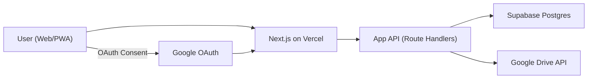

# 撮影絵コンテアプリ 設計（MVP）

## 1. 目的と確定要件
- まずは Vercel 上の Web アプリとして公開し、将来 iOS アプリへ展開する。
- 保存先は Google Drive を採用する。
- 共有単位は「プロジェクトフォルダ」。
- RAW は本アプリでは扱わない（JPG中心）。
- ショット必須項目:
  - `title`（not null）
  - `status`（not null）
- ショットステータス:
  - `構想`
  - `未撮影`
  - `撮影済`
  - `現像済`
  - `共有済`
- ライティング配置を画面上でシミュレートできるようにする。

## 2. 技術方針
- Frontend: Next.js (App Router) + TypeScript
- Hosting: Vercel
- DB: Supabase Postgres
- Auth: Google OAuth（ログイン + Drive 連携）
- File Storage: Google Drive
- 図面エディタ: React Konva（自前の軽量ライティングエディタ）

理由:
- Drive はファイル共有に強いが、検索/並び替え/コメント/状態管理は DB が必要。
- Web と iOS で共通 API と DB を使える設計にしておくと移植が速い。

## 3. 全体アーキテクチャ


責務分離:
- Drive: JPG/PDFなど実ファイル
- DB: プロジェクト、ショット、並び順、状態、コメント、図面JSON、権限

## 4. 機能スコープ（MVP）
1. Google ログイン
2. プロジェクト作成
3. プロジェクト作成時に Drive フォルダ自動生成
4. シーン/ショット CRUD
5. ショット並び替え
6. 参考画像（JPG）アップロード
7. コメント
8. ライティング図面編集（配置/回転/ラベル）+ 保存

MVP外（Phase 2+）:
- オフライン同期
- PDF自動生成の高度化
- 納品フロー拡張

## 5. 画面と URL 設計
- `/login`
  - Google サインイン
- `/projects`
  - プロジェクト一覧
  - 新規作成ボタン
- `/projects/new`
  - タイトル、日付、場所、参加者（任意）
- `/projects/{projectId}`
  - プロジェクト概要
  - タブ:
    - `storyboard`（絵コンテ）
    - `lighting`（ライティング）
    - `comments`（コメント）
    - `delivery`（納品）
- `/projects/{projectId}/shots/{shotId}`
  - ショット詳細
  - 必須項目編集: タイトル、ステータス
  - 参考画像、構図メモ、ライティング図面

URLクエリ例:
- `/projects/{projectId}?tab=storyboard`
- `/projects/{projectId}/shots/{shotId}?tab=lighting`

## 6. Drive フォルダ設計
プロジェクト作成時に自動作成:

```text
CosplayShoot/
  Projects/
    YYYY-MM-DD_<projectTitle>_<projectId>/
      10_refs/        # 参考画像 JPG
      40_edits/       # 現像後 JPG
      60_diagrams/    # ライティング図面 PNG
      90_exports/     # PDF/JPG 共有物
```

運用:
- このプロジェクトフォルダを共有対象にする。
- Drive スコープはまず `drive.file` を基本にする。

## 7. API 設計（MVP）
### プロジェクト
- `POST /api/projects`
  - 入力: `title`, `shootDate`, `location`
  - 処理: Drive フォルダ生成 + DB 登録
- `GET /api/projects`
  - 自分がメンバーのプロジェクト一覧
- `GET /api/projects/:projectId`
  - 詳細取得

### シーン/ショット
- `POST /api/projects/:projectId/scenes`
- `PATCH /api/scenes/:sceneId`
- `POST /api/scenes/:sceneId/shots`
- `PATCH /api/shots/:shotId`
- `POST /api/shots/reorder`

### 画像/アセット
- `POST /api/shots/:shotId/assets`
  - JPGアップロード後、`drive_file_id` を保存
- `GET /api/shots/:shotId/assets`

アップロード方針（推奨）:
- 画像は `Browser -> Google Drive` の直接アップロード（resumable）を基本にする。
- API はバイナリ中継せず、`drive_file_id` とメタ情報のみ保存する。
- 理由: Vercel 関数のリクエストサイズ上限に縛られず、スマホ写真でも安定運用しやすい。

### ライティング
- `PUT /api/shots/:shotId/lighting`
  - `diagram_json` 保存
- `POST /api/shots/:shotId/lighting/export`
  - PNG生成 -> Drive保存（任意）

### コメント
- `POST /api/projects/:projectId/comments`
- `POST /api/shots/:shotId/comments`
- `GET /api/projects/:projectId/comments`

## 8. ライティング図面の最小仕様
MVPで必要な編集:
- オブジェクト追加: 被写体 / カメラ / ライト
- ドラッグ移動
- 回転
- ラベル編集（例: Key, Fill）
- 保存（JSON）

`diagram_json` 例:
```json
{
  "version": 1,
  "canvas": { "width": 1200, "height": 800, "grid": 40, "unit": "px" },
  "objects": [
    { "id": "subject_1", "type": "subject", "x": 600, "y": 400, "rotation": 0, "label": "Model" },
    { "id": "camera_1", "type": "camera", "x": 220, "y": 420, "rotation": 10, "label": "Camera" },
    { "id": "light_1", "type": "light", "x": 360, "y": 260, "rotation": 35, "label": "Key", "modifier": "softbox", "power": "1/16" }
  ],
  "notes": ""
}
```

## 9. 権限モデル
- アプリ権限（DB）:
  - `owner` / `editor` / `viewer`
- ファイル権限（Drive）:
  - プロジェクトフォルダ共有で制御

安全性:
- DB と Drive の両方で権限を持つ二層構造にする。
- RLS で「メンバーのみ参照/更新可」を必須化。

## 10. iOS 展開前提の設計ポイント
- UI と API を分離（BFF/API層を先に固定）。
- ライティング図面は JSON で保存し、クライアント差し替え可能にする。
- iOS化時は同一 API を利用して再実装（React Native/SwiftUIどちらも可能）。

## 11. 開発ロードマップ
### Phase 1（公開最短）
1. Auth
2. Projects
3. Scenes/Shots CRUD
4. JPGアップロード
5. コメント

### Phase 2（現場強化）
1. ライティング図面エディタ
2. PNG書き出し
3. 操作性改善（テンプレート、ショット複製）

### Phase 3（納品強化）
1. 納品リスト
2. PDF出力
3. 共有リンク導線

## 12. 実装開始時の確定事項（この設計で固定）
- 共有単位はプロジェクトフォルダ
- RAWは扱わない（JPGのみ）
- ショット必須: `title`, `status`
- `status` 値: `構想`, `未撮影`, `撮影済`, `現像済`, `共有済`
